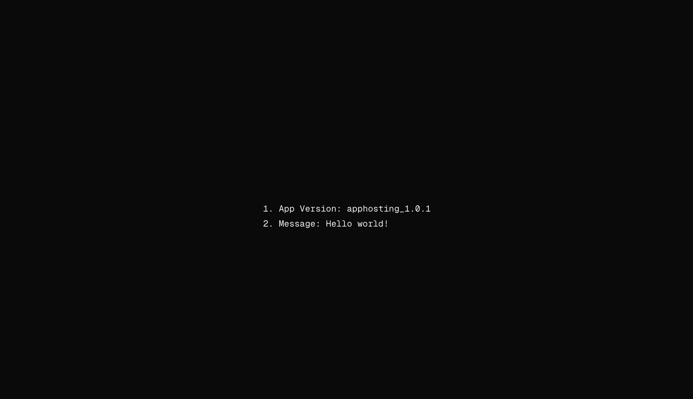

# Repro for issue 8757

## Versions

firebase-tools: v14.7.0 
node: v20.19.1 

## Steps to reproduce

1. Create a new GitHub repository
1. Push this code
1. Run `firebase apphosting:backends:create`
1. Check the deployed app
   - env variable `MESSAGE` and `APP_VERSION` are loaded
     

## Notes

Maybe a backend issue?

- There isn't any App Hosting related changes in release notes for [14.7.0](https://github.com/firebase/firebase-tools/releases/tag/v14.7.0)
